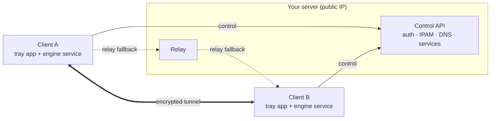

<div align="center">

# zwan

**Self-hosted private overlay network — bring your own server, join from anywhere.**

[](./LICENSE)
[](https://github.com/Zeliper/zwan/releases)
[](https://github.com/Zeliper/zwan/releases)
[](https://go.dev)

[한국어 README →](./README.ko.md)

</div>

---

zwan lets anyone host their **own** private network. Host a server (you need a public IP),
share a token, and devices connect from anywhere over **encrypted WireGuard tunnels** —
**directly, or through your server's relay when they're behind NAT**. Services are reached
by **name** (`nas.home.zwan`) instead of chasing IPs, ports, and router settings.

Think Tailscale/ZeroTier, but **you run the control plane** and **a client can join several
independent networks at once**. Open source, no central dependency.

## Features

- 🔐 **Encrypted overlay** — WireGuard data plane (userspace `wireguard-go` + Wintun on Windows).
- 🏠 **Self-hosted** — run your own control server + relay; no third party in the loop.
- 🔏 **TLS by default** — the control API gets an automatic Let's Encrypt certificate when you have a domain, and a pinned self-signed key when you only have an IP.
- 🌐 **Works behind NAT** — clients tunnel through your public-IP server's relay when a direct path isn't available.
- 🧭 **Name-based access** — split-DNS resolver maps `service.<your-suffix>` to the right node.
- 🚪 **Service addresses** — every published service gets an address of its own, so a name is all a client needs and two services can share a port. TCP and UDP; the real backend stays bound to `127.0.0.1`.
- 👥 **Group ACLs** — hand each group its own join token and write rules between them; a member never receives the keys of a peer it may not reach.
- 🔀 **Multi-network client** — join several independent networks at once. Each gets its own adapter, key, UDP port and name space, and nothing routes between them.
- 🖥️ **Desktop app** — one tray app for both roles (join a network, host one), with a **system dark/light theme**; SYSTEM services do the work in the background.
- ⬆️ **Auto-update** — the client updates itself from GitHub releases; the server can self-update too (`--auto-update`).

## How it works



The control channel is **TLS**. With a domain the certificate is issued automatically over
ACME; without one the server keeps a self-signed key and publishes its fingerprint (pin),
which the client verifies instead of a CA chain — so an IP-only server is authenticated too.

The **control plane** (server) only exchanges membership, endpoints, service and DNS
records. The **data plane** is peer-to-peer WireGuard; when peers can't reach each other
directly, packets are relayed through your server (which has the public IP).

On Windows both roles run as **SYSTEM services** — `zwanEngine` (`zwan-service.exe`) for the
tunnel and `zwanServer` (`zwan-server.exe`) for a hosted network — while the **tray/GUI**
runs as your user and talks to each over its own named pipe. Closing the window changes
nothing: the tunnel stays up and the network stays hosted.

## Install

Grab the latest from **[Releases](https://github.com/Zeliper/zwan/releases)**.

**Windows** — `zwan-setup.exe`
Installs the tray app and lets you pick either role, or both:

- **Client** — the `zwanEngine` service and the Wintun virtual-WAN driver, for joining networks.
- **Server** — the `zwanServer` service, for hosting one. Pick this alone for a server box with no tunnel driver installed.

It starts at login and auto-updates from future releases.
*(The build is unsigned, so SmartScreen may warn — “More info” → “Run anyway”.)*

**Linux server** — headless binaries: `zwan-server-linux-amd64`, `zwan-server-linux-arm64`
(`zwan-server-windows-amd64.exe` and `-arm64.exe` are there too, for running the server from
a terminal instead of the service).

## Quick start

**1. Host a network** (on a machine with a public IP):

*With a domain* pointed at the box — a real certificate is issued automatically over ACME:

```bash
./zwan-server-linux-amd64 \
  --token YOUR-SECRET-TOKEN \
  --network home --dns-suffix home.zwan \
  --addr 0.0.0.0:443 --domain vpn.example.com \
  --relay-public vpn.example.com:3478 \
  --auto-update
```

*Without a domain* — the server keeps a self-signed key and prints the pin clients verify:

```bash
./zwan-server-linux-amd64 \
  --token YOUR-SECRET-TOKEN \
  --network home --dns-suffix home.zwan \
  --addr 0.0.0.0:8787 --public-host YOUR.PUBLIC.IP:8787 \
  --relay-public YOUR.PUBLIC.IP:3478
```

Either way it prints the address to hand out, pin included:

```text
clients join with: --server "https://YOUR.PUBLIC.IP:8787#sha256:NMuaxTGRTKlRnx..." --token <token>
```

Open the control port (TCP `443` or `8787`) and UDP `3478` (relay) on your firewall. When
ACME runs on a port other than 443, also open TCP `80` for the HTTP-01 challenge.

**2. Join from a client:**

- **Desktop:** run `zwan-setup.exe`, open **zwan**, **Join** → paste the whole join address into **Server** (the pin is split out for you), add the token, connect.
- **Or host from the desktop:** the app's **Host** tab configures the `zwanServer` service — network, TLS mode, token — and shows the join address to share. The network keeps running once you close the window; the tray can stop it.

**3. Publish a service** (keep the backend on localhost):

```bash
# on the node that runs, say, a game server on 127.0.0.1:31001
zwan-agent --server "https://YOUR.PUBLIC.IP:8787#sha256:NMuaxTGRTKlRnx..." --token YOUR-SECRET-TOKEN \
  --device my-nas --name nas --up --relay \
  --publish-name minecraft --publish-port 25565 --publish-backend-port 31001
```

The server gives the service an address of its own, so members reach it by name on the
port the game already uses — `minecraft.home.zwan`, port 25565 — with nothing to look up.
A second server on the same machine and the same port is a different address, so it does
not clash:

```text
minecraft.home.zwan   100.64.128.1:25565   ->  127.0.0.1:31001
survival.home.zwan    100.64.128.2:25565   ->  127.0.0.1:31002
voice.home.zwan       100.64.128.3:64738   ->  127.0.0.1:31003   (udp)
```

The real backends stay bound to `127.0.0.1` throughout. Devices are numbered from the
lower half of the overlay range and services from the upper half, so the two can never
collide.

## Several networks at once

A device can join more than one network, and the pieces that are naturally
singular are separated on purpose: each network gets its own Wintun adapter, node
key and UDP port, so nothing is shared that could carry traffic from one into
another. There is a single DNS resolver, because a machine can only own
`127.0.0.1:53` once, and each network is a zone inside it.

Names are scoped by a **local name** you choose when joining, not by the suffix
the server advertises — two servers may well both call themselves `home.zwan`:

```text
join alice's server, local name "alice"   ->  nas.alice
join bob's server,   local name "bob"     ->  nas.bob
```

Addresses are translated per network, so two networks may use the same overlay
range — the default is the same for everyone — without colliding here. Each
network gets a slice of a local pool (`100.112.0.0/12` by default), and the
device holds a local address in it while the tunnel carries the real one:

```text
alice   this device 100.112.0.1   in the network 100.64.0.1
bob     this device 100.113.0.1   in the network 100.64.0.1   (the same, and fine)
```

Only local addresses reach the host's routing table, so a server is free to use
that pool as its own overlay range too. Translation can be turned off, in which
case overlapping networks are reported instead of fixed.

## Access control

By default every member reaches every other, which is what a household wants. To
split a network up, give each group its own join token and write rules between
the groups:

```bash
./zwan-server-linux-amd64 --token FAMILY-TOKEN \
  --join-token dev=DEV-TOKEN --join-token guest=GUEST-TOKEN --join-token nas=NAS-TOKEN \
  --acl "dev->nas" --acl "guest->nas"
```

The token a device joins with decides its group — nothing the client sends does.
The first rule flips the network to default-deny, so `dev` and `guest` above can
each reach `nas` but never each other. Larger policies can live in a JSON file
passed with `--acl-file`, and the desktop app's **Host** tab edits the same
groups and rules.

Enforcement is by omission rather than by filtering: a member is simply not told
about peers it may not reach, and without a peer's public key there is no tunnel
to it. A service can be narrowed further than its host node:

```bash
zwan-agent ... --publish-name files --publish-port 445 \
  --publish-backend-port 31445 --publish-allow dev
```

That one is checked twice — the control server hides it from other groups, and
the node hosting it refuses connections from them, so knowing the address and
port is not enough.

## Build from source

Requires Go 1.23+, Node 18+, and (for the installer) NSIS. For the GUI, the
[Wails](https://wails.io) CLI: `go install github.com/wailsapp/wails/v2/cmd/wails@latest`.

```bash
go build ./...          # server + CLI agent + service
go test  ./...
cd gui && wails build    # desktop app  ->  gui/build/bin/gui.exe

scripts/build-release.sh 0.1.1   # all release artifacts -> dist/
```

## Project layout

```
cmd/            zwan-server (control plane + Windows service) · zwan-agent (CLI) · zwan-service (engine service)
server/         api · ipam · store · relay · host · tlsconf (ACME / self-signed) · config · ipc · supervisor
client/         manager · engine · vip (per-network addressing) · tun · wg · wgbind · resolver · l4 · join · ipc · profile · update
shared/         proto · keys · certpin (SPKI pinning) · acl (group policy)
gui/            Wails v2 desktop app + tray (React + Tailwind + shadcn/ui)
installer/      NSIS installer (app + optional client and server services)
```

## Status & roadmap

Working today: control plane over TLS (ACME or pinned self-signed), group ACLs, per-service
addresses (TCP + UDP), encrypted tunnel
(direct + relay), split-DNS + service registry, L4 service router, desktop app (tray +
service + IPC), Windows installer, auto-update. Verified end-to-end minus the parts that
need Administrator / two machines.

On the roadmap: NAT traversal, system DNS integration (NRPT), IPv6 transport, and code
signing.

See [`구현계획.md`](./구현계획.md) (implementation plan) and
[`MyWAN_가상네트워크_아이디어_정리.md`](./MyWAN_가상네트워크_아이디어_정리.md) (design notes).

## Contributing

Issues and PRs welcome. Keep dependencies permissively licensed (MIT/BSD/Apache/ISC) —
no GPL/AGPL/LGPL (see [`THIRD_PARTY_NOTICES.md`](./THIRD_PARTY_NOTICES.md)).

## Security

Pre-release software. The control API speaks TLS by default — ACME with `--domain`, and a
persistent self-signed key otherwise, which clients authenticate by pin. Hand that pin over
a channel you trust (it is part of the printed join address); a client given no pin falls
back to normal CA verification and will refuse a self-signed server. `--tls=off` remains
for local testing and reverse-proxy setups and sends tokens in the clear. Treat join tokens
as secrets.

The join token only authorizes joining. Registration returns a per-device node
token, and the membership and service directories require it — so reaching the
API is not enough to enumerate a network, and a member can only publish services
on its own node. Found a vulnerability? Please open a private report rather than a public issue.

## License

[Apache-2.0](./LICENSE).
