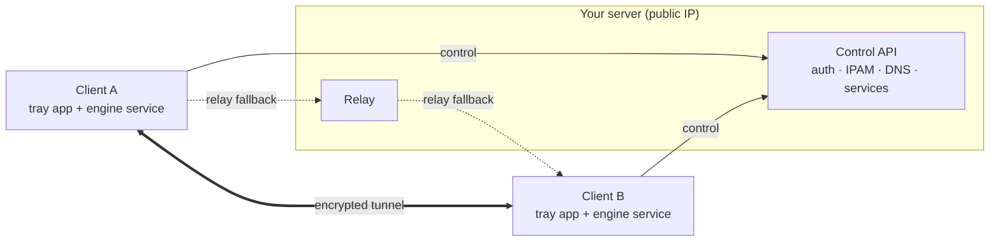

<div align="center">

# zwan

**Self-hosted private overlay network — bring your own server, join from anywhere.**

[](./LICENSE)
[](https://github.com/Zeliper/zwan/releases)
[](https://github.com/Zeliper/zwan/releases)
[](https://go.dev)

[한국어 README →](./README.ko.md)

</div>

---

zwan lets anyone host their **own** private network. Host a server (you need a public IP),
share a token, and devices connect from anywhere over **encrypted WireGuard tunnels** —
**directly, or through your server's relay when they're behind NAT**. Services are reached
by **name** (`nas.home.zwan`) instead of chasing IPs, ports, and router settings.

Think Tailscale/ZeroTier, but **you run the control plane** and **a client can join several
independent networks at once**. Open source, no central dependency.

## Features

- 🔐 **Encrypted overlay** — WireGuard data plane (userspace `wireguard-go` + Wintun on Windows).
- 🏠 **Self-hosted** — run your own control server + relay; no third party in the loop.
- 🌐 **Works behind NAT** — clients tunnel through your public-IP server's relay when a direct path isn't available.
- 🧭 **Name-based access** — split-DNS resolver maps `service.<your-suffix>` to the right node.
- 🚪 **L4 service router** — publish a service and keep the real backend bound to `127.0.0.1` (never exposed on the LAN/internet).
- 🔀 **Multi-network client** *(in progress)* — one client, several independent networks, without address/DNS collisions.
- 🖥️ **Desktop app** — system-tray client with a **system dark/light theme**; a SYSTEM service does the tunnelling.
- ⬆️ **Auto-update** — the client updates itself from GitHub releases; the server can self-update too (`--auto-update`).

## How it works



The **control plane** (server) only exchanges membership, endpoints, service and DNS
records. The **data plane** is peer-to-peer WireGuard; when peers can't reach each other
directly, packets are relayed through your server (which has the public IP).

On Windows the tunnel runs in a **SYSTEM service** (`zwan-service`); the **tray/GUI** runs
as your user and talks to the service over a named pipe.

## Install

Grab the latest from **[Releases](https://github.com/Zeliper/zwan/releases)**.

**Windows client** — `zwan-setup.exe`
Installs the tray app, the SYSTEM engine service, and the Wintun virtual-WAN driver,
and starts at login. It auto-updates from future releases.
*(The build is unsigned, so SmartScreen may warn — “More info” → “Run anyway”.)*

**Server** (host your own network on a public-IP box) — headless binaries:
`zwan-server-linux-amd64`, `zwan-server-linux-arm64`,
`zwan-server-windows-amd64.exe`, `zwan-server-windows-arm64.exe`.

## Quick start

**1. Host a network** (on a machine with a public IP):

```bash
./zwan-server-linux-amd64 \
  --token YOUR-SECRET-TOKEN \
  --network home --dns-suffix home.zwan \
  --addr 0.0.0.0:8787 \
  --relay-public YOUR.PUBLIC.IP:3478 \
  --auto-update
```

Open TCP `8787` (control) and UDP `3478` (relay) on your firewall.

**2. Join from a client:**

- **Desktop:** run `zwan-setup.exe`, open **zwan**, **Join** → server `http://YOUR.PUBLIC.IP:8787`, token, connect.
- **Or host from the desktop:** the app's **Host** tab runs a server in-process and generates a token to share.

**3. Publish a service** (keep the backend on localhost):

```bash
# on the node that runs, say, a game server on 127.0.0.1:31001
zwan-agent --server http://YOUR.PUBLIC.IP:8787 --token YOUR-SECRET-TOKEN \
  --device my-nas --name nas --up --relay \
  --publish-name minecraft --publish-port 25565 --publish-backend-port 31001
```

Other members reach it by name — `minecraft.home.zwan:25565` — while the real backend
stays bound to `127.0.0.1`.

## Build from source

Requires Go 1.23+, Node 18+, and (for the installer) NSIS. For the GUI, the
[Wails](https://wails.io) CLI: `go install github.com/wailsapp/wails/v2/cmd/wails@latest`.

```bash
go build ./...          # server + CLI agent + service
go test  ./...
cd gui && wails build    # desktop app  ->  gui/build/bin/gui.exe

scripts/build-release.sh 0.1.1   # all release artifacts -> dist/
```

## Project layout

```
cmd/            zwan-server (control plane) · zwan-agent (CLI) · zwan-service (SYSTEM service)
server/         api · ipam · store · relay · host
client/         engine · tun · wg · wgbind · resolver · l4 · join · ipc · profile · update
shared/         proto · keys
gui/            Wails v2 desktop app (React + Tailwind + shadcn/ui)
installer/      NSIS installer (client + service + Wintun driver)
```

## Status & roadmap

Working today: control plane, encrypted tunnel (direct + relay), split-DNS + service
registry, L4 service router, desktop app (tray + service + IPC), Windows installer,
auto-update. Verified end-to-end minus the parts that need Administrator / two machines.

On the roadmap: TLS/ACME for the control API (currently plain HTTP), ACLs, client-local
VIP indirection + UDP proxy, IPv6 transport, and code signing.

See [`구현계획.md`](./구현계획.md) (implementation plan) and
[`MyWAN_가상네트워크_아이디어_정리.md`](./MyWAN_가상네트워크_아이디어_정리.md) (design notes).

## Contributing

Issues and PRs welcome. Keep dependencies permissively licensed (MIT/BSD/Apache/ISC) —
no GPL/AGPL/LGPL (see [`THIRD_PARTY_NOTICES.md`](./THIRD_PARTY_NOTICES.md)).

## Security

Pre-release software. The control API is plain HTTP for now; run it behind TLS or a
tunnel if it carries anything sensitive, and treat tokens as secrets. Found a
vulnerability? Please open a private report rather than a public issue.

## License

[Apache-2.0](./LICENSE).
